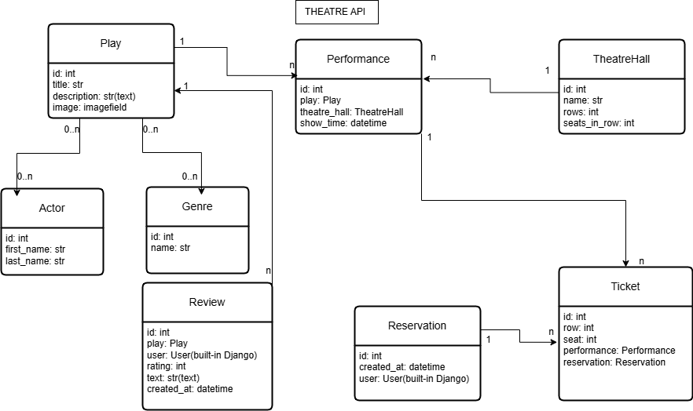

# theatre-api-project

This is an API for a theater website. Using this API, you can create a website where you can view upcoming performances,
their genres, and the actors who play in these performances. You can also view available seats in the theater hall and
create orders with tickets.

The API has the following database structure:



Theatre API allows:

- Using api/admin/ — Work with the admin panel
- Using /api/doc/swagger/ — Detailed API documentation via Swagger
- Using /api/doc/redoc/ — Detailed API documentation via Redoc
- Using [GET] /api/user/me/ — Get information about the user
- Using [PUT, PATCH] /api/user/me/ — Update user information
- Using [POST] /api/user/register/ — Register a new user
- Using [POST] /api/user/token/ — Obtain new access and refresh tokens using credentials
- Using [POST] /api/user/token/refresh/ — Obtain a new access token using a refresh token
- Using [POST] /api/user/token/verify/ — Verify the access token
- Using [GET] /api/theatre/actors/ — Actors list
- Using [POST] /api/theatre/actors/ — Add new actor
- Using [GET] /api/theatre/genres/ — Genres list
- Using [POST] /api/theatre/genres/ — Add new genre
- Using [GET] /api/theatre/performances/ — Performances list
- Using [POST] /api/theatre/performances/ — Add new performance
- Using [GET] /api/theatre/performances/{id}/ — Performance detailed information
- Using [PUT, PATCH] /api/theatre/performances/{id}/ — Update performance information
- Using [DELETE] /api/theatre/performances/{id}/ — Delete performance information
- Using [GET] /api/theatre/plays/ — Plays list
- Using [POST] /api/theatre/plays/ — Add new play
- Using [GET] /api/theatre/plays/{id}/ — Play detailed information
- Using [POST] /api/theatre/plays/{id}/upload-image/ — Upload image for play
- Using [GET] /api/theatre/orders/ — Reservations list
- Using [POST] /api/theatre/orders/ — Add new reservation
- Using [GET] /api/theatre/theatre_halls/ — Theatre halls list
- Using [POST] /api/theatre/theatre_halls/ — Add new theatre hall

## Installation

Make sure Python 3 is already installed.

You also need to install PostgreSQL and create a database.

Set up the environment:

```
git clone https://github.com/dirolius/theatre-api-service
cd theatre_api_service
python3 -m venv venv
source venv/bin/activate
pip install -r requirements.txt
echo > .env
```

For an example of filling out .env, see .env.sample!

Migrate the database and run the server:

```
python manage.py migrate
```

You could install fixtures via:

```
python manage.py loaddata theatre_dump.json
```

Run server:

```
python manage.py runserver
```

# Features

- JWT Authentication:
- Admin panel: /admin/
- Documentation is available at: </api/doc/swagger/>, </api/doc/redoc/>
- Managing reservations and tickets
- Creating plays with genres and actors
- Creating theatre halls
- Creating performances with show times, plays, and theatre halls
- Filtering plays and performances

## Getting Access

To create a superuser:

```
python manage.py createsuperuser
```

Alternatively, you can create a default user using the following link:
http://127.0.0.1:8000/api/user/register/

To work with the token use the following API endpoints:

- Get access token and refresh token:

```
http://127.0.0.1:8000/api/user/token/
```

- Refresh access token:

```
http://127.0.0.1:8000/api/user/token/refresh/
```

- Verify access token:

```
http://127.0.0.1:8000/api/user/token/verify/
```